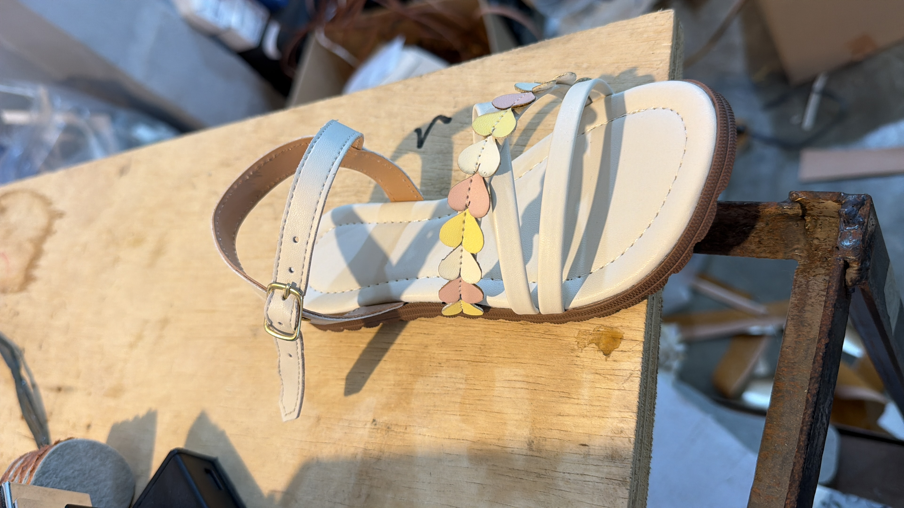

# Análise de rendimento — sandália infantil 25–34

> Continuação do ciclo ficha→PV→débito→Kanban (**mesmo PR**).  
> Branch: `cursor/alinhamento-ficha-pv-debito-kanban-43d3`  
> Foto de referência: `docs/assets/sandalia-infantil-25-34-traseiro-tiras.jpg`  
> Faixa: **25–34** · Grade auditoria: **480 pares** (80 em 29/30 · 40 nos demais)  
> Ficha quantitativa usada: **I701** (`049cef09-f46f-4017-b9c7-e927b52b8632`) — dublado 1370 mm  
> Se a foto for **outra referência**, informar o código da ficha para reapontar o SQL.

## Objetivo

Analisar o **rendimento dos itens em separado**, nesta ordem:

1. **Traseiro** primeiro  
2. **Tiras da frente** depois  

Rendimento = `pares ÷ metros` (pares por metro linear de material).

---

## Anatomia da peça (pela foto)

| Grupo | Peças visíveis | Material aparente |
|---|---|---|
| **1. Traseiro** | Contraforte no calcanhar + tira de tornozelo com fivela dourada e furos de ajuste | Sintético off-white (mesmo material do cabedal) · forro bege no verso |
| **2. Tiras da frente** | (a) tira decorativa superior com **corações** pastel sobrepostos · (b) tira lisa intermediária · (c) tira lisa inferior | Base off-white + recortes de coração em rosa / amarelo / branco |
| Apoio (fora deste corte) | Palmilha acolchoada + solado marrom texturizado | Não entram no rendimento de cabedal/tiras |

Ordem de análise pedida = **traseiro → tiras da frente**. Corações coloridos são **acréscimo de cor** sobre a tira superior da frente (mesmo consumo geométrico da base + scrap de cor por coração).

---

## Veredito — rendimento separado (grade 480)

Base quantitativa: duas peças de **área do cabedal** da I701 (auditoria Glow viva 05/09/2026), mapeadas à anatomia da foto:

| Ordem | Grupo (foto) | Fonte na ficha | dm²/par | m na grade 480 | **Rendimento** |
|:---:|---|---|---:|---:|---:|
| **1** | **Traseiro** (contraforte + tornozelo) | `upper_consumption` | 2,74 | **9,600000** | **50,0000 pares/m** |
| **2** | **Tiras da frente** (3 tiras + base dos corações) | acessório mandatory | 2,28 | **7,988321** | **≈ 60,0877 pares/m** |
| Σ | Cabedal off-white (mesma matéria) | — | 5,02 | **17,588321** | **≈ 27,2908 pares/m** |

Fórmula: `m = dm²/par × pares ÷ 137` (largura útil 1370 mm → 137 dm²/m).

**Confirmação viva (Glow):** cabedal principal **9,6 m** + segunda linha **7,988321 m** = `(2,74 + 2,28) × 480 ÷ 137`.  
Travado por `analyzeI701CabedalPiecesSeparated()` + testes.

> **Mapeamento foto↔ficha:** hipótese até labels vivos — peça maior (2,74) = traseiro; peça menor (2,28) = frente. Se o plano de corte inverter os rótulos, trocar as seções; os **números de m e rendimento não mudam**.

---

## 1) Traseiro — 2,74 dm²/par · 50 pares/m

Peças da foto: **contraforte do calcanhar** + **tira de tornozelo** (fivela + furos).

| size | pares | dm² | m |
|---:|---:|---:|---:|
| 25 | 40 | 109,60 | 0,800000 |
| 26 | 40 | 109,60 | 0,800000 |
| 27 | 40 | 109,60 | 0,800000 |
| 28 | 40 | 109,60 | 0,800000 |
| 29 | 80 | 219,20 | 1,600000 |
| 30 | 80 | 219,20 | 1,600000 |
| 31 | 40 | 109,60 | 0,800000 |
| 32 | 40 | 109,60 | 0,800000 |
| 33 | 40 | 109,60 | 0,800000 |
| 34 | 40 | 109,60 | 0,800000 |
| **Σ** | **480** | **1315,20** | **9,600000** |

| métrica | valor |
|---|---:|
| consumo médio / par | 0,020000 m |
| **rendimento** | **50,0000 pares/m** |

Hardware (fivela dourada): item de aviamento — **não** entra no rendimento de metro do sintético.

---

## 2) Tiras da frente — 2,28 dm²/par · ≈ 60,09 pares/m

Peças da foto:

1. Tira superior com **fileira de corações** (rosa / amarelo / branco)  
2. Tira lisa intermediária  
3. Tira lisa inferior  

| size | pares | dm² | m |
|---:|---:|---:|---:|
| 25 | 40 | 91,20 | 0,665693 |
| 26 | 40 | 91,20 | 0,665693 |
| 27 | 40 | 91,20 | 0,665693 |
| 28 | 40 | 91,20 | 0,665693 |
| 29 | 80 | 182,40 | 1,331387 |
| 30 | 80 | 182,40 | 1,331387 |
| 31 | 40 | 91,20 | 0,665693 |
| 32 | 40 | 91,20 | 0,665693 |
| 33 | 40 | 91,20 | 0,665693 |
| 34 | 40 | 91,20 | 0,665693 |
| **Σ** | **480** | **1094,40** | **7,988321** |

| métrica | valor |
|---|---:|
| consumo médio / par | 0,016642 m |
| **rendimento** | **≈ 60,0877 pares/m** |

### Corações coloridos (acréscimo)

Os corações são recortes **sobrepostos** na tira superior. O consumo **geométrico da base** já está no 2,28 dm². O scrap de **cor** (rosa/amarelo/branco) é material **adicional por cor**, tipicamente em `strap_colors` / acessórios coloridos — **não** está no fixture I701/Glow usado aqui. Pendente de SQL live para metragem por cor.

---

## Soma (conferência)

| grupo | m / 480 pares |
|---|---:|
| 1. Traseiro | 9,600000 |
| 2. Tiras da frente | 7,988321 |
| **Total sintético off-white** | **17,588321** |

Rendimento conjunto do dublado/sintético: **≈ 27,2908 pares/m**.

---

## Tiras lineares (`strap_colors`) — se a ficha usar cm/par

Se esta referência cadastrar as tiras em **cm/par** (em vez de dm² de área), o motor `analyzeInfantilSandalYield` + SQL `sql-scripts/audit-i701-rendimento-traseiro-tiras-25-34.sql` classificam:

1. linhas com rótulo **traseiro/talão/calcanhar** → bucket traseiro  
2. demais tiras (e rótulo **frente**) → bucket tiras da frente  

Runner: `scripts/run-infantil-yield-analysis.mjs` (exige `VITE_SUPABASE_URL` + service role).  
Neste ambiente: **sem secrets** → números lineares vivos ainda pendentes.

---

## Artefatos (mesmo PR)

| Tipo | Caminho |
|---|---|
| Foto | `docs/assets/sandalia-infantil-25-34-traseiro-tiras.jpg` |
| Analisador | `src/lib/infantilSandalYieldAnalysis.ts` |
| Testes (5) | `src/lib/__tests__/infantilSandalYieldAnalysis.test.ts` |
| SQL live | `sql-scripts/audit-i701-rendimento-traseiro-tiras-25-34.sql` |
| Runner | `scripts/run-infantil-yield-analysis.mjs` |
| Glow | `docs/AUDITORIA_I701_GLOW_INTEGRACAO.md` |

## Status

- [x] Anatomia da foto: traseiro vs tiras da frente documentada  
- [x] Rendimento **separado** na ordem pedida (traseiro → frente)  
- [x] Números I701 conferem Glow viva (17,588321 m)  
- [x] Mesma branch/PR  
- [ ] Confirmar se a foto é I701 ou outra ficha (código)  
- [ ] Labels vivos + scrap dos corações via SQL live  

**Sem PRs separados.**
