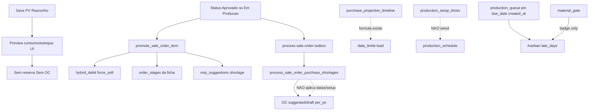

# Compras ↔ Produção entrelaçadas (auditoria + alvo)

> Spec fechada por grill em 21/09/2026. **Canônica** para demanda de compra
> originada em PV, datas de necessidade, consolidação de OC, hub temporal em
> `/purchase-planning` e priorização de produção por solado+cor.
>
> **Substitui integralmente** (não complementar):
>
> - [`automacao-ordens-compra-demanda-pv.md`](automacao-ordens-compra-demanda-pv.md)
> - [`projecao-compras-semanal-integrada.md`](projecao-compras-semanal-integrada.md)
> - [`alinhamento-motores-consumo-compras-ondas.md`](alinhamento-motores-consumo-compras-ondas.md)
> - [`remodelagem-criacao-ordem-de-compra.md`](remodelagem-criacao-ordem-de-compra.md)
>
> Entrega desta sessão: **auditoria (as-is) + spec de alvo**. Implementação é
> etapa seguinte, fora deste arquivo até o dono autorizar build.

## Goal

Um único sistema em que, ao **aprovar** um pedido de venda:

1. o consumo vem da ficha técnica;
2. o estoque disponível é **soft-reservado**;
3. a falta vira necessidade de compra com data = início do setor − setup − lead − buffer;
4. a OC nasce consolidada, pronta para **export na janela** (PDF sempre; XML se o fornecedor tiver layout);
5. produção e compras usam a mesma chave de agrupamento **solado + cor**;
6. o gestor vê necessidade × tempo × cor/variação num hub só e pode adiantar / segurar / cancelar o envio.

Otimiza, em ordem de serviço quando conflitarem: **não faltar no setor** (primário); depois agrupamento de OC, capital (via janela de envio, não via “não comprar”), fila/setup e visibilidade.

## Decisões fechadas (grill)

| # | Tema | Escolha |
|---|---|---|
| D1 | Entrega | Auditoria + spec; sem implementar nesta etapa |
| D2 | Fluxo descrito pelo dono | **Alvo** (medir gap vs as-is) |
| D3 | Escopo | Compras **e** produção, entrelaçados |
| D4 | Critérios de otimização | Todos: fill rate, capital, OC agrupada, fila, visibilidade — com **serviço primeiro** em conflito |
| D5 | Serviço vs capital | Serviço primeiro; janela de envio mitiga capital |
| D6 | Hierarquia de setup | **Solado + cor** (cabedal só desempate) |
| D7 | Gate de material | Advisory forte + pin do gestor; **sem** reordenar fila automaticamente por material |
| D8 | Gatilho de compromisso | Status do PV → **Aprovado** |
| D9 | Criar vs enviar OC | Cria OC pronta no Aprovado; **scheduler envia na janela**; hub permite adiantar/segurar/cancelar |
| D10 | Superfícies solado+cor | Planejamento + compras + Kanban (toggle) |
| D11 | Setup na data | `production_setup_times` **entra** em `data_limite_compra` |
| D12 | Artefato | Um `specs/…md` canônico |
| D13 | Hub temporal | Evoluir **`/purchase-planning`** |
| D14 | Kanban | Toggle setup vs atraso; **default = atraso**; pin soberano; preferência lembrável depois |
| D15 | Consolidação OC | Por produto/cor/fornecedor na mesma janela; vínculos aos PVs |
| D16 | Pedidos na OC | Códigos **PV** (`order_number`) + **`client_order_number`** de cada PV incluso |
| D17 | Falha de cadastro | PV aprova + reserva; OC `blocked` com motivo + alerta; não envia |
| D18 | “Enviar” | Gerar **PDF sempre** + **XML se flag/layout do fornecedor** + marcar enviada |
| D19 | Specs antigas | **Substituídas** por este arquivo |

## As-is (auditoria 21/09/2026)

### Pipeline atual após PV



| Etapa do alvo | Status | Onde vive hoje |
|---|---|---|
| Consumo pela ficha | EXISTS | `orderConsumption.ts`, `calculate_order_consumption*` |
| Checagem de estoque | EXISTS | `check_stock_availability` (promote + previews) |
| Reserva se houver saldo | PARTIAL | Soft-reserve **sempre** no approve (`p_force_soft`), inclusive em falta; não é “só o que cabe” |
| OC automática se falta | EXISTS | Outbox → `process_sale_order_purchase_shortages` (`source_type='per_pv'`) |
| OC respeita lead + início de setor + **prep/setup** | PARTIAL | Fórmula em `purchase_projection_timeline` / `weeklyPurchasingPlan`; **outbox não grava** `purchase_by_date`/chegada; setup **não** entra no schedule |
| Camada purchase_requisition | MISSING | Demanda vai direto a `purchase_orders` |
| Hub temporal único com adiantar/segurar/cancelar envio | PARTIAL | `/purchase-planning` existe (abas fragmentadas); per-PV e MRP são outras portas; sem scheduler de export |
| Fila por solado+cor | MISSING no motor vivo | Wave legado agrupava `sole|color` e foi aposentado; vivo = pin → prazo → criação |
| Gate material trava ou reordena | MISSING (de propósito hoje) | Advisory no Kanban |
| Lista PV + pedido cliente na OC consolidada | MISSING / PARTIAL | Contribuições existem em caminhos novos; campo agregado canônico + `client_order_number` não é o contrato da OC auto |

### Donos canônicos atuais (não reinventar sem migrar)

| Papel | Dono |
|---|---|
| Auto-compra pós-aprovação | Edge `process-sale-order-outbox` → `process_sale_order_purchase_shortages` (contrato em `saleOrderPurchaseOwner.contract.test.ts`) |
| Soft-reserve na promoção | `hybrid_debit_stock_for_order(..., p_force_soft => true)` |
| Baixa real | `settle_open_reservations_for_order` no finalize |
| Fila de produção | `v_production_queue_detail` / `recompute_production_schedule` |
| Projeção de datas | `purchase_projection_timeline`, `get_effective_supplier_lead_days` |

### Telas envolvidas

- Compras: `/purchase-planning`, `/purchase-orders`, `/purchase-orders/per-pv`, `/quotations`, MRP embutido
- Produção: `/producao/planejamento`, `/producao/kanban`, `/producao/analises?view=setup`

## Alvo — comportamento

### 1. Gatilho

Quando o PV passa a **`Aprovado`**:

1. Recalcular consumo canônico (mesmos motores TS/SQL já alinhados; sem reintroduzir perda de corte).
2. Soft-reservar materiais do PV/OPs promovidas (caminho atual de promote, dono server-side).
3. Para cada falta líquida (estoque − reservado − em trânsito/OC aberta já vinculada): criar ou atualizar **necessidade** e materializar/atualizar **OC pronta** (não enviada), consolidando (ver §3).
4. Gravar em cada OC/necessidade: `data_necessidade_setor`, `data_limite_compra`, `data_chegada_exigida`, chave de agrupamento solado+cor quando aplicável, contribuições por PV.

**Não** criar reserva/OC no save de Rascunho. Compras manuais, RFQ e ROP/mínimo continuam fluxos separados (não apagados por esta spec).

### 2. Data de necessidade (fórmula canônica)

```
data_inicio_setor     = do production_schedule (capacidade regressiva / plano vivo)
setup_dias            = production_setup_times para a troca relevante (solado/cor);
                        se cadastro ausente → buffer configurável por setor (fallback explícito)
lead_fornecedor_dias  = get_effective_supplier_lead_days (dias corridos)
buffer_dias           = parâmetro de folga (já usado na projeção; não inventar segundo)

data_chegada_exigida  = data_inicio_setor − setup_dias − buffer_dias
data_limite_compra    = data_chegada_exigida − lead_fornecedor_dias
```

Regra de calendário (herdada e ratificada): **produção** usa calendário fabril; **fornecedor/prep de compra** usa dias corridos — não misturar.

Serviço primeiro: se `data_limite_compra ≤ hoje`, a OC entra imediatamente na fila de envio do scheduler.

### 3. Consolidação de OC

- Chave: `(product_id | cor, supplier_id)` dentro da **mesma janela** de `data_limite_compra` (definição de janela = parâmetro da spec de implementação; default alinhado à quinzena já usada na automação antiga, documentar no PR de build).
- Cada OC traz campo agregado (UI + persistência) com **todos** os PVs inclusos:
  - `sale_orders.order_number`
  - `sale_orders.client_order_number`
- Linhas da OC continuam discriminando material/cor/qtd; o cabeçalho/campo lista os pedidos.
- Cancelar/alterar um PV: recalcula contribuições; **não** cancela a OC inteira se ainda houver outros PVs (corrigir o buraco antigo).

### 4. Envio (scheduler + hub)

Estados mínimos da OC de demanda-PV:

| Estado | Significado |
|---|---|
| `ready` / draft enviável | Criada no Aprovado; aguarda janela |
| `blocked` | Sem preço, sem fornecedor, conversão inválida, tira artesanal sem receita, etc. — motivo obrigatório |
| `held` | Gestor segurou no hub |
| `exported` / enviada | PDF (+ XML se couber) gerado; timestamp registrado |
| `cancelled` | Só se todas as contribuições sumiram |

Scheduler:

- Seleciona OCs `ready` com `hoje ≥ data_limite_compra` (e não `held`/`blocked`).
- Gera **PDF** sempre; **XML** somente se o fornecedor tiver flag/layout cadastrado.
- Marca enviada. Canal WhatsApp/e-mail nativo **fora do v1** (humano usa o arquivo).

Hub **`/purchase-planning`** (evolução, não rota nova):

- Visão temporal: o quê / quanto / quando / cor-variação / PVs.
- Ações: **adiantar envio**, **segurar**, **cancelar** (com trilha).
- Absorve a decisão que hoje está espalhada em abas + per-PV; per-PV vira filtro/modo ou deep-link, não segunda porta de verdade.
- UX: densidade dashboard, timeline + tabela, bulk actions, chips de filtro que refluem; **tokens do Industrial Editorial** (não paleta gerada por tool).

### 5. Produção entrelaçada

- Chave de setup: **solado + cor**; cabedal/`construction_type` só desempate / roteiro.
- Planejamento: após pin e (conforme modo) prazo, agrupar/sequenciar por solado+cor.
- Kanban: toggle **“priorizar atraso”** (default) vs **“priorizar setup (solado+cor)”**; dentro do bloco, atraso; **pin** sempre no topo.
- Gate de material: badge + KPI + ready date (**advisory forte**); gestor pode pinagem/override; **não** hard-block apontamento no v1 desta spec; **não** auto-reordenar a fila só porque material atrasou (a compra/scheduler é quem corrige o tempo).
- `planned_start` continua podendo considerar `GREATEST(capacidade, material_ready)` como sinal — sem contradizer o advisory.

### 6. Falhas de cadastro (D17)

- Aprovação do PV **não** é bloqueada por falta de preço/fornecedor.
- Material problemático: necessidade/`blocked` no hub + alerta ao papel comprador.
- Materiais ok seguem fluxo normal (serviço primeiro no que for possível comprar).

## Mudanças por camada (para a fase de build)

Orientação; detalhe de PR fica na implementação.

| Camada | Mudança |
|---|---|
| SQL / RPC | Amarrar writer pós-aprovação a `data_limite_*` + setup; consolidação com contribuições PV; campo/agregado `order_number` + `client_order_number`; estados `blocked`/`held`/`exported` |
| Edge outbox | Deixar de ser “cria OC sem data”; passar a criar/atualizar OC **ready** com datas; **não** exportar no outbox — export é scheduler |
| Scheduler | Job (Edge cron ou equivalente já usado no projeto) para export PDF/XML na janela |
| `/purchase-planning` | Hub temporal + ações; reduzir abas mortas |
| Produção | Toggle Kanban; desempate/agrupamento solado+cor no planejamento; wire `production_setup_times` na fórmula de data |
| Contratos de teste | Estender `saleOrderPurchaseOwner`; guards de data (setup+lead); consolidação não apaga PV irmão; export idempotente |

## Fora de escopo (v1 desta spec / build seguinte)

- Implementação nesta sessão de grill
- E-mail/WhatsApp/API de fornecedor nativos
- Hard-lock de apontamento por material
- Reativar UI de ondas (`/pcp/ondas`)
- Redesign visual fora de planejamento / kanban / hub de compras
- Reintroduzir perda de corte / `waste_pct`
- Purchase requisition como entidade separada (necessidade pode ser view/RPC sem tabela nova, a menos que o build prove o contrário)

## Definition of done (quando for implementar)

1. Aprovar PV com falta → OC `ready` com `data_limite_compra` refletindo schedule + setup + lead; sem export se fora da janela.
2. Dois PVs mesma napa/cor/fornecedor na mesma janela → **uma** OC listando ambos `order_number` + `client_order_number`.
3. Fornecedor sem preço → PV aprovado; item/OC `blocked` visível no hub; demais fluxos intactos.
4. Hub: adiantar / segurar / cancelar altera envio; scheduler respeita.
5. Na janela: PDF gerado; XML só com flag; status enviada.
6. Kanban default = atraso; toggle setup muda ordem visual por solado+cor; pin vence.
7. As quatro specs antigas permanecem só como histórico com banner superseded.
8. Typecheck `bunx tsc -p tsconfig.app.json --noEmit`; contratos novos verdes; verificação em produção via browser agent no fluxo Aprovar → hub → (simular janela) export — conforme regra do dono.

## Apêndice — referências de código

- Promote / soft debit: `promote_sale_order_item`, `hybrid_debit_stock_for_order`
- Outbox: `supabase/functions/process-sale-order-outbox/index.ts`, `process_sale_order_purchase_shortages`
- Projeção: `purchase_projection_timeline`, `src/lib/weeklyPurchasingPlan.ts`, `src/pages/PurchasePlanning.tsx`
- Setup: `src/pages/SetupTimes.tsx`, tabela `production_setup_times`
- Fila: `src/hooks/useProductionEngine.ts`, `src/pages/ProducaoPlanejamento.tsx`, `src/pages/ProducaoKanbanGestao.tsx`
- Gate: `src/hooks/useMaterialGate.ts`
- PV fields: `sale_orders.order_number`, `sale_orders.client_order_number`
