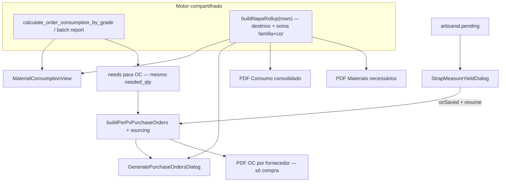

# Consumo × OC — paridade, rollup de napa e redesign

**Status:** plano fechado com o dono (grill 27/09/2026). Aguardando execução.

## Problema

Na tela `/sales?view=consumo` o trilho mostra **114,46 m** de material base; o modal **Gerar ordem de compra** mostra **95,00 m** (mesmo com estoque ignorado). São pipelines diferentes:

| Face | Fetch | KPI material base |
|------|-------|-------------------|
| Consumo / PDF consolidado | `calculate_consumption_report_batch` | `computeBaseMaterialTotal` por `componentType` (tiras **fora**) |
| Modal OC / PDF materiais | `compute_per_pv_purchase_needs_v2` | `computePurchaseBaseTotal` por nome de grupo sobre qty **a comprar** |

## Decisões fechadas

1. Unificar cálculo **e** redesenhar UI (tela consumo inteira + modal + 3 PDFs).
2. Fonte de verdade = consumo que **reserva no lançamento** (`calculate_order_consumption_by_grade` → `hybrid_debit_stock_for_order`).
3. Motor **compartilhado** (não “OC manda” nem “só passar rows da UI”).
4. **Rollup de napa** por destino: Cabedal · Forração · cada tira (m de tira + m de napa convertidos) → **soma por família+cor**. Tiras **entram** no total (revoga exclusão de 24/09 no KPI).
5. OC honra **sourcing** do PV: napa própria → compra napa; tira pronta → compra tira.
6. Segundo bloco: solado / cola / embalagem / demais, com a mesma paridade.
7. PDFs: consolidado + materiais necessários **com rollup**; PDF OC/fornecedor **só lista de compra**.
8. Rendimento pendente → abre `StrapMeasureYieldDialog` → salva → **retoma** PDF/OC automaticamente.
9. Modos: Consumo total = ignora estoque; Cobertura = desconta estoque — colunas alinhadas ao modo.
10. Visual: tokens do ERP (Industrial Editorial); `/ui-pro` + `/frontend-design` = hierarquia/IA, não marca nova.

## Arquitetura alvo

### Motor / dados

- Manter `loadPvConsumption` → `calculate_consumption_report_batch` como leitura canônica da necessidade bruta (já é o motor do débito/reserva).
- Fazer `compute_per_pv_purchase_needs_v2` / `compute_materials_per_pv` **derivar as mesmas quantidades brutas** desse motor (auditoria SQL se ainda houver drift; corrigir no SQL, não no browser).
- Nova lib `src/lib/napaRollup.ts` (ou evolução de `baseMaterialTotal.ts`):
  - Destinos: `Cabedal` | `Forração` | `Forração Palmilha` | `Fachete` | tira artesanal (tipo + m tira + `baseQty` napa).
  - Agrupa por `normalizeBaseFamilyName` + cor.
  - Total por família+cor = soma de todos os destinos (direto + via tira).
  - `pending` listado sem metros de napa até cadastrar.
- `computeBaseMaterialTotal` passa a usar o rollup (ou vira wrapper) — **inclui** napa de tira; testes em `baseMaterialTotal.test.ts` rebaseados.
- OC: `partitionPerPvStrapPurchaseItems` + sourcing — linhas `internal` consolidam napa no SKU-rolo; `finished` compram tira; nunca duplicar napa+tira no mesmo destino.

### UI — tela de consumo

Arquivos: [`MaterialConsumptionView.tsx`](src/components/sale-orders/MaterialConsumptionView.tsx), [`ConsumptionDecisionRail.tsx`](src/components/sale-orders/ConsumptionDecisionRail.tsx), [`SummaryConsumptionPanel.tsx`](src/components/sale-orders/SummaryConsumptionPanel.tsx).

1. **Herói:** painel “Necessidade de napa” com rollup (família → cor → destinos → total).
2. **Mapa de solados** e filtros reorganizados (densidade, hierarquia; tokens existentes).
3. **Demais materiais** em bloco separado abaixo.
4. Modo Consumo total: não mostrar colunas de líquido/estoque como se fossem compra; rótulos “necessidade bruta”.
5. Modo Cobertura: Necessário / Estoque / Falta (líquido).
6. CTA Gerar OC continua passando `{ grossNeed }` → `netOfStock: !grossNeed`.

### UI — modal OC

Arquivo: [`GeneratePurchaseOrdersDialog.tsx`](src/components/purchase/GeneratePurchaseOrdersDialog.tsx).

1. Topo: mesmo rollup de napa (números idênticos ao consumo no modo alinhado).
2. Alertas (sem fornecedor, OC aberta, preço) em **collapsibles** — não parede.
3. Tabela: colunas conforme `netOfStock` (bruto vs líquido).
4. KPI “Material base” = total do rollup (bruto) ou soma a comprar de napa (líquido) — **rótulo explícito** do que é.
5. Antes de gerar PDF/OC: se houver `pending`, abrir yield dialog em sequência; ao salvar, invalidar queries e retomar a ação.

### PDFs

| Arquivo | Mudança |
|---------|---------|
| [`materialConsumptionReport.ts`](src/lib/materialConsumptionReport.ts) | Seção napa = rollup por destino + total; demais materiais depois |
| [`printPerPvMaterials.ts`](src/lib/printPerPvMaterials.ts) | Mesmo rollup + lista a comprar alinhada ao modo |
| [`printPerPvOcPdf.ts`](src/lib/printPerPvOcPdf.ts) | Só SKU/qtd/preço por fornecedor — sem rollup |

### Testes

- Unit: `napaRollup` / `baseMaterialTotal` — cabedal+forração+tiras → soma correta; pending não infla.
- Contract: consumo KPI === modal KPI (mesmo fixture de rows) no modo bruto.
- Wiring: yield pending → dialog → resume gera PDF/OC.
- Paridade buyList × rollup atualizada.
- Typecheck: `bunx tsc -p tsconfig.app.json --noEmit`.
- Tokens: `bun run check:tokens` após UI.

### Verificação em produção

Após merge em `main` + deploy: abrir `computerUse` em https://squadshoes-real.vercel.app no fluxo PV-00195/00196 (ou equivalentes), conferir rollup, Gerar OC, PDF interno e yield pendente se houver.

## Fora de escopo

- Alterar regra de perda de corte (continua inexistente).
- Reconciliar OCs históricas / furos de débito antigos.
- Redesenhar Hub de Tiras além do dialog de rendimento já existente.
