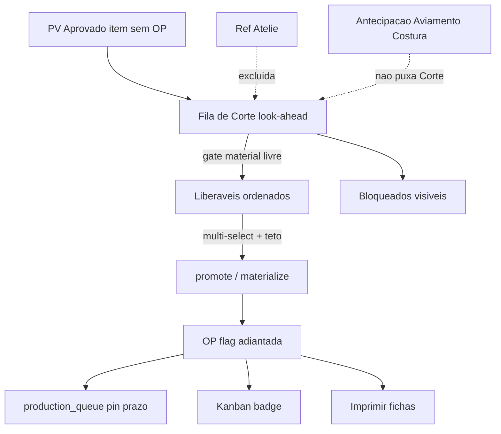

# Fila de Corte — look-ahead (fecha PV / caixa)

> Spec fechada por grill em 29/09/2026. **Canônica** para a v1 do look-ahead de
> Corte: puxar demanda futura de PV aprovado, priorizar o que fecha pedido para
> faturar, só com material livre, e liberar OP marcada como adiantada.
>
> **Status implementação (29/09/2026):** v1 entregue —
> rota `/producao/corte-lookahead`, hook `useCorteLookahead`, RPC
> `release_corte_lookahead_items` (flag `orders.is_ahead_of_schedule`), badge/filtro
> Adiantadas no Kanban. Capacidade = `sector_settings.daily_capacity_pairs` por
> tipo de corte.
>
> **⚠ Atualização 03/10/2026:** a decisão **D17** (“liberação não reordena
> Planejamento / `production_queue` por caixa”) foi **superseded** por
> [`sequencia-producao.md`](sequencia-producao.md). Passa a existir uma **ordem
> oficial global** (fechar PV → billing → cor → ref); o Lookahead vira **vista**
> dessa ordem, sem score paralelo. O restante desta spec (filas por tipo de
> corte, gate de material principal, flag adiantada, exclusão ateliê) permanece
> válido até a migração para o sequenciador.
>
> **Não substitui** [`compras-producao-entrelacadas.md`](compras-producao-entrelacadas.md)
> (capital via janela de OC) nem [`atelie-cabedal-complexo.md`](atelie-cabedal-complexo.md)
> (cabedal complexo / rua). Complementa o motor diário de
> [`remodelagem-producao.md`](remodelagem-producao.md).

## Goal

Dar ao gestor de Corte uma **fila por tipo de corte** que:

1. mostra demanda futura (item de PV aprovado ainda sem OP);
2. ordena primeiro por **material+cor livre** (não prometido a outro pedido), depois por score que favorece **fechar o PV para faturar**;
3. explica o motivo em chips;
4. permite multi-select → criar OP normal com flag **adiantada**, atrelada ao PV, entrando no kanban/fila como hoje.

Otimiza, quando conflitarem: **completar pedido para expedir/faturar** (primário). Eficiência de bobina/cor e APS multi-setor ficam de fora desta v1.

## Background / Problem

- Hoje o Corte é **puxada manual** em `/imprimir-fichas` sobre OPs já existentes — não há fila que “olhe à frente” da carteira aprovada.
- A tela **Antecipação** (`/producao/antecipacao`) adianta Aviamento / Costura Cabedal via `start_offset_days`; decisão do dono (30/08/2026) **não** puxa Corte nessa antecipação.
- O motor `production_queue` ordena por **pin → prazo → criação**, não por condição de pagamento nem por “% do PV completo”.
- Agrupar por cor (clássico calçadista) maximiza rendimento de corte, mas atrasa o fechamento de PVs mistos — o dono escolheu **PV/prazo + estoque livre**, não lote por cor.
- Ateliê resolve cabedal complexo à parte; essas refs **não devem disputar** a bancada interna de Corte.

## Decisões fechadas (grill)

| # | Tema | Escolha |
|---|---|---|
| D1 | Objetivo de caixa | **Fechar PV completo** mais cedo para faturar/expedir |
| D2 | Eixo de organização | Por **PV / data de entrega** (cor secundária) |
| D3 | Escopo v1 | Só **fila de Corte com look-ahead** (não APS multi-setor) |
| D4 | Fonte de demanda | Itens de PV **Aprovado** ainda **sem OP** (+ residual sem OP) |
| D5 | Teto vs montagem | **Sem teto em dias** — freio = capacidade diária de corte |
| D6 | Ação ao puxar | **Sugere promover** → cria OP para identificar peça adiantada e atrelar ao PV |
| D7 | Score (após estoque) | `valor_restante_a_faturar_do_PV × 1/(dias_até_delivery_deadline+1)`; desempate `% completo do PV`, depois mais antigo |
| D8 | Estoque | Só liberável se material+cor do setor **não estiver reservado a outro pedido**; checagem no material principal do setor |
| D9 | Motivo na UI | **Chips** estruturados (estoque / score / % PV / prazo / gaps) |
| D10 | Falta de material | Linha **visível bloqueada** (não some) |
| D11 | Capacidade | Teto **por tipo de corte** (Cabedal / Forração / Palmilha / Fibra) |
| D12 | OP adiantada | OP **normal + flag** `adiantada` (origem look-ahead); badge/filtro no kanban |
| D13 | Material do setor | Prioridade/bloqueio olham só o **material principal** daquele corte (Q11-A) |
| D14 | Ateliê | Ref cadastrada no Ateliê **não disputa** a fila interna (hoje nenhuma tem corte na rua) |
| D15 | UI | Rota nova `/producao/corte-lookahead` (rótulo sugerido: **Fila de Corte**) |
| D16 | Granularidade | Átomo = item de PV (ref+cor/variante) → 1 OP; **multi-select** no dia |
| D17 | Motor global | ~~Ao liberar, OP entra no `production_queue` igual às outras; não reordena Planejamento por caixa~~ → **SUPERSEDED 03/10/2026** por [`sequencia-producao.md`](sequencia-producao.md) (ordem oficial global por caixa) |
| D18 | Reserva “livre” | Dono da reserva pode continuar; **outro** PV não adianta com o mesmo SKU prometido (A+D) |
| D19 | Lista | Só sem OP (A+C): aprovados + residual sem OP; OPs já criadas ficam no kanban |

## Scope

### In scope

- Página `/producao/corte-lookahead` com abas/filas por tipo de corte.
- Query de candidatos: `sale_order_items` de PV `Aprovado` (e residual sem OP) elegíveis ao roteiro daquele corte.
- Exclusão de refs presentes no cadastro Ateliê.
- Ordenação D7 + gate D8/D18; chips D9; bloqueados D10.
- Capacidade diária por tipo (leitura/edição alinhada a `sector_settings` ou equivalente por setor de corte).
- Multi-select → promote/materialize OP com flag `adiantada` (coluna ou metadado persistido).
- Badge/filtro “Adiantada” no Kanban gestão.
- CTA pós-liberação para `/imprimir-fichas` (não obrigar impressão na mesma tela).
- Nav + `RouteGuard` no módulo Produção.

### Out of scope (explicitamente não agora)

- APS / sequenciador multi-setor por caixa.
- Reordenar `production_queue` / Planejamento pelo score de caixa.
- Teto de WIP vs montagem em dias ou pares.
- Agrupamento primário por cor/bobina (setup de corte).
- Liberação parcial de grade (pares).
- Criar ficha/documento de corte **sem** OP.
- Compra/OC / MRP (permanece em compras-produção entrelaçadas).
- Montagem, expedição, pontuação financeira por `payment_condition` (pode informar chip depois; não manda na v1).
- Pesos configuráveis do score.
- Mudar Antecipação para puxar Corte (esta fila é o caminho novo).
- Capacidade auto-derivada de apontamento histórico (override manual do teto ok).

## Requirements

1. **R1 — Rota**: existir `/producao/corte-lookahead` autenticada (`ProtectedRoute` + `RouteGuard`), entrada no hub Produção / `navigation.ts`.
2. **R2 — Filas**: quatro filas (ou abas) — Corte Cabedal, Corte Forração, Corte Palmilha, Corte Fibra — cada uma com teto de pares/dia configurável.
3. **R3 — Candidatos**: listar itens de PV em status firmado **Aprovado** (e itens sem OP de PV já em produção quando houver residual), **sem** `orders` vinculada ao item; excluir refs do Ateliê.
4. **R4 — Elegibilidade de roteiro**: só itens cuja ficha inclui o setor da fila ativa (`production_sectors` / mesma regra de `orderInRoteiro` das fichas).
5. **R5 — Gate de estoque**: linha **liberável** só se o SKU do material principal daquele setor/cor tiver quantidade livre suficiente **sem** consumir reservas de **outro** pedido; senão **bloqueada visível** com gap.
6. **R6 — Alocação simulada no dia**: ao ordenar o lote liberável, simular consumo do saldo livre na ordem da lista para não pintar duas linhas “verdes” que esgotam o mesmo SKU.
7. **R7 — Score**: entre liberáveis, ordenar por D7; exibir chips: estoque, score/valor restante, % PV completo, prazo, gaps.
8. **R8 — Capacidade**: multi-select não pode confirmar liberação que estoure o teto de pares da fila do dia (somar pares dos itens selecionados).
9. **R9 — Liberação**: confirmação cria OP via caminho de promote/materialize existente (reserva/débito híbrido intacto), persiste origem/flag **adiantada**, associa ao `sale_order_item` / PV.
10. **R10 — Kanban**: OPs adiantadas aparecem no motor normal com badge e filtro “Adiantadas”.
11. **R11 — Motivo**: toda linha (liberável ou bloqueada) expõe chips; expand/detalhe pode repetir a frase completa — lista não fica só com ícone.
12. **R12 — Sem reordenar global**: liberação **não** altera a regra pin/prazo/criação do schedule para as demais OPs.

## Data model / Domain

### Existente a reusar

| Peça | Papel |
|---|---|
| `sale_orders` / `sale_order_items` | Demanda; `status`, `delivery_deadline`, `total` |
| `orders` + `sale_order_item_id` | OP; ausência = candidato |
| `promote_sale_order_item` / outbox materialize | Criação de OP + soft reserve |
| `material_reservations` + `products.quantity` / `reserved_stock` | Gate D8/D18 |
| `technical_sheets.production_sectors` | Elegibilidade de setor |
| `production_queue` / `recompute_production_schedule` | Entrada pós-liberação |
| `sector_settings` | Capacidade pares/dia (estender ou mapear 4 cortes) |
| Cadastro Ateliê (`atelier_*` / refs complexas) | Exclusão D14 |
| Consumo por setor / ficha | Identificar **material principal** do corte (espelhar resolução já usada em fichas de operador) |

### Novo / extensão

| Peça | Notas |
|---|---|
| Flag OP adiantada | Preferência: coluna em `orders` (ex. `advanced_from_cutoff` / `is_early_release` + `early_release_source='corte_lookahead'`) **ou** metadado já existente se houver — escolher o que o promote atual permita sem second motor |
| Capacidade dos 4 cortes | Se `sector_settings` já tem uma linha por nome de setor de corte, reusar; senão mapear nomes canônicos iguais aos de `PRODUCTION_STAGES` / fichas |
| (Opcional) RPC `list_corte_lookahead(sector)` | Pode nascer na implementação se a query for pesada; não é requisito de produto |

### Score (contrato)

```
urgency = 1 / (max(0, dias_calendario_até_delivery_deadline) + 1)
score   = valor_restante_a_faturar_do_PV * urgency
```

- `valor_restante_a_faturar_do_PV`: na v1, usar proporção do `sale_orders.total` ainda não coberta por itens já com OP (ou total do PV se mais simples e documentado) — **default de implementação**: `total × (pares_sem_OP / pares_totais_do_PV)` se pares forem rastreáveis; senão `total` do PV inteiro até haver campo melhor.
- PV sem `delivery_deadline`: urgency mínima (vai ao fim entre os liberáveis).
- `% completo do PV` (desempate): pares já com OP / pares totais do PV.

### “Material principal” por fila

| Fila | Material principal (v1) |
|---|---|
| Corte Cabedal | Material de cabedal / upper resolvido para a cor do item |
| Corte Forração | Forro (cabedal ou palmilha conforme a ficha daquele worksheet) |
| Corte Palmilha | Placa / palmilha |
| Corte Fibra | Material de fibra da ficha |

Detalhe de resolução = mesmo resolver das fichas de operador / `orderConsumption` — não inventar segunda regra de BOM.

### Reserva livre (D18)

- Reserva ativa (`reserved` / equivalente) em `material_reservations` para o SKU, cujo `order_id` (OP) pertence a **outro** `sale_order` → saldo dessa reserva **não** conta como livre para adiantar o PV atual.
- Reservas do **próprio** PV/OP irmão: não impedem o item de aparecer; o saldo livre é `quantity − reservas_de_outros` (e a alocação simulada R6).
- Reservas canceladas / consumidas / reconciliadas: ignorar.

## User flows

### Happy path

1. Gestor abre **Fila de Corte** → aba Corte Cabedal.
2. Vê lista ordenada: liberáveis no topo (estoque livre + score), bloqueados abaixo com gap.
3. Chips mostram por quê cada linha está onde está.
4. Seleciona N linhas até o teto do dia → **Liberar adiantamento**.
5. Sistema cria N OPs (promote), marca adiantadas, soft-reserva como hoje.
6. OPs aparecem no Kanban com badge; gestor imprime fichas no fluxo atual.

### Alternate / edge flows

- **Bloqueado por material**: aparece; não selecionável; chip de gap; link útil a estoque/compra se já existir padrão no app.
- **Ref Ateliê**: não entra na disputa (excluída da lista ou seção “fora” sem seleção — preferência: **excluída** da fila interna).
- **Teto estourado**: confirmar desabilita / erro claro com pares selecionados vs teto.
- **Promote falha**: toast de erro; demais selecionados — decidir na implementação: all-or-nothing da seleção (➡️ **default: all-or-nothing** da confirmação).
- **Dois gestores**: segunda liberação vê saldo já reservado; R5/R6 reavaliam no submit.

## Edge cases & failure modes

| Caso | Comportamento |
|---|---|
| PV aprovado sem `delivery_deadline` | Entra; urgency mínima; chip “sem prazo” |
| Item sem material resolvível na ficha | Bloqueado; chip “cadastro incompleto” |
| Mesmo SKU, dois PVs liberáveis | Só o primeiro na ordem “gasta” o livre simulado; o segundo pode virar bloqueado no dia |
| OP adiantada cancelada | Flag morre com a OP; estoque volta pelas regras atuais de estorno — **não** inventar estorno novo |
| Ficha sem o setor da aba | Item não lista naquela aba |
| Capacidade 0 / não cadastrada | UI exige teto > 0 ou trata 0 como “só visualizar” (➡️ **default: teto 0 = não libera**, só lista) |

## Constraints & assumptions

- Package manager Bun; typecheck `bunx tsc -p tsconfig.app.json --noEmit`; tokens de design; ícones Phosphor.
- Domínio pt-BR; keys React Query em inglês.
- Não reintroduzir perda de corte; não usar `lucide-react`.
- Débito/reserva da promote permanece o canônico (`hybrid_debit` / soft) — flag adiantada **não** desliga reserva (D rejeitado no grill).
- Antecipação (`start_offset_days`) **não** passa a puxar Corte; esta spec é o substituto de produto para look-ahead de Corte.
- Assunção: nomes dos quatro cortes batem com os já usados em fichas/roteiro; se houver alias, normalizar numa tabela única no código.
- Assunção de valor restante (R7): fórmula de pares acima até existir AR/faturamento por item mais fino.

## Relação com as-is (não reimplementar)



## Open questions

Nenhum de produto bloqueante. Só decisões finas de implementação (nome da coluna da flag; RPC vs query client) — cabem no PR.

## Definition of Done

- [ ] **R1** — Abrir `/producao/corte-lookahead` logado com permissão de Produção; rota no hub; sem permissão → RouteGuard.
- [ ] **R2** — Quatro filas/abas com teto editável; tentar liberar além do teto falha com mensagem clara.
- [ ] **R3/R4** — PV aprovado sem OP e com setor na ficha aparece; ref Ateliê não disputa; item sem setor da aba não aparece nela.
- [ ] **R5/R18** — Com reserva de outro PV no SKU principal, linha bloqueada ou sem saldo livre; PV dono da reserva ainda pode ser tratado nas regras do próprio fluxo.
- [ ] **R6** — Dois itens que juntos passam do livre: só o primeiro selecionável/verde na ordem; o segundo mostra bloqueio/gap após alocação simulada.
- [ ] **R7/R11** — Ordem entre liberáveis respeita score; chips visíveis com estoque, score/%, prazo, gaps.
- [ ] **R9** — Liberar cria OP ligada ao item/PV, com flag adiantada; ficha imprimível depois.
- [ ] **R10** — No Kanban, badge + filtro Adiantadas.
- [ ] **R12** — Demais OPs no Planejamento continuam pin/prazo/criação; score de caixa não reescreve a queue global.
- [ ] Typecheck limpo (`tsconfig.app.json`); tokens ok se UI nova; verificação em produção pós-deploy conforme regra do dono.

## Próximo passo

Implementação **somente** após o dono autorizar o build desta spec (não misturar com remodelagem de ondas nem com scheduler de OC).
